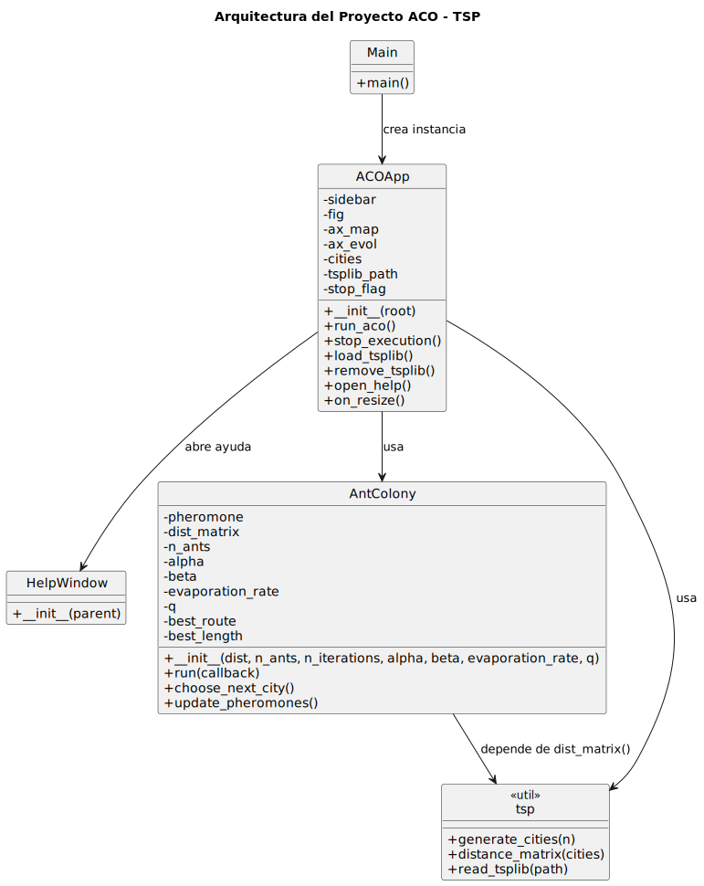
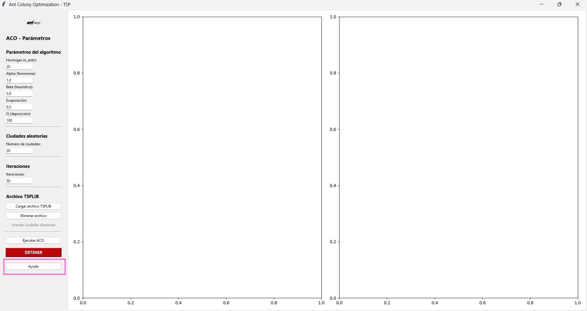
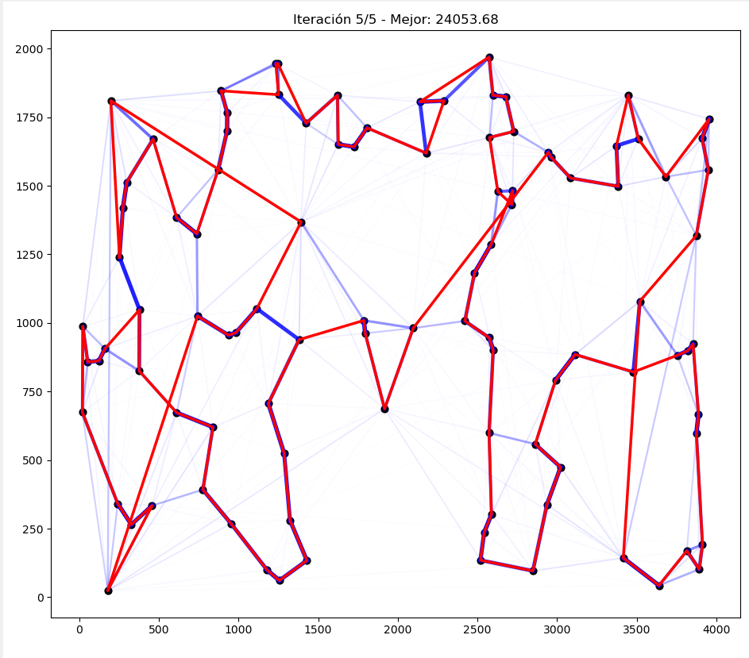
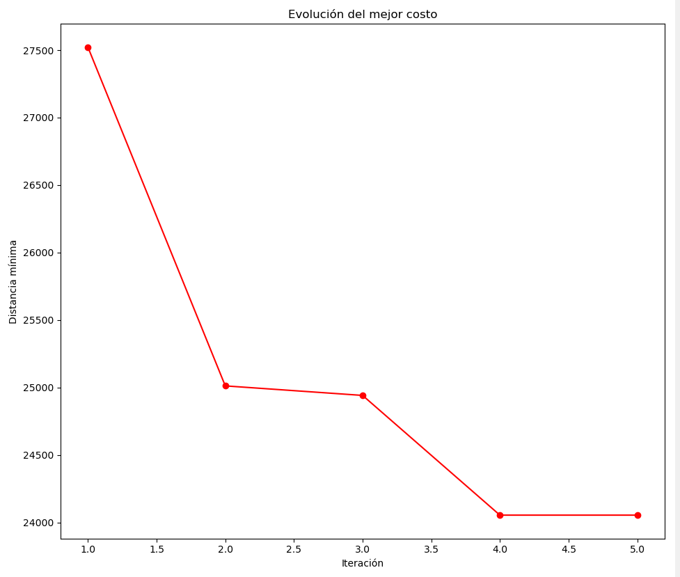

# Ant Colony Optimization (ACO) - TSP

<picture>
  <source srcset="img/logo_l.png" media="(prefers-color-scheme: dark)">
  <source srcset="img/logo.png" media="(prefers-color-scheme: light)">
  
</picture>

Este proyecto implementa el algoritmo de optimización por colonia de hormigas (Ant Colony Optimization, ACO) para resolver el Problema del Viajante (TSP).

El TSP consiste en encontrar la ruta más corta que visita todas las ciudades una vez y regresa al punto inicial. El enfoque de ACO se basa en el comportamiento colectivo de las hormigas reales, que depositan feromonas para marcar caminos más eficientes, generando una forma de búsqueda probabilística cooperativa.

## Estructura del Proyecto

```
aco_tsp/
│
├── aco.py
├── acoUI.py
├── help_window.py
├── tsp.py
├── main.py
├── tsp/                # Instancias TSPLIB preguardadas
│   ├── eil51.tsp       # Instancia de 51 ciudades
│   ├── kroA100.tsp     # Instancia de 100 ciudades
│   └── tsp200.tsp      # Instancia de 200 ciudades
└── README.md
```

### Especificación de requisitos

#### Requisitos funcionales

1. **Generación de ciudades aleatorias:**
   El sistema debe generar N ciudades con coordenadas aleatorias en un plano 2D.

2. **Lectura de instancias TSPLIB:**
   El sistema debe permitir cargar archivos .tsp con instancias de ciudades de la libreria TSPLIB .

3. **Ejecución del algoritmo ACO:**
   Debe ejecutar el algoritmo Ant Colony Optimization sobre el conjunto de ciudades generado.

4. **Interfaz grafica con:**

   4.1. Mapa con ciudades, feromonas y mejor ruta.

   4.2. Evolución del costo mínimo por iteraciones.

   4.3. Control en tiempo real

   4.4. Botón Ejecutar ACO.

   4.5. Botón Detener.
   4.6. Ventana de ayuda
   Mostrar explicación de parámetros y del algoritmo.

5. Parametrización dinámica del algoritmo durante la simulación.

#### Requisitos no funcionales

1. **Rendimiento:** El algoritmo debe ejecutar iteraciones con una pausa para visualización. Debe aceptar entre 10 y 300 ciudades sin que la interfaz colapse.

2. **Usabilidad:** Interfaz clara con sidebar organizado por secciones.

3. **Portabilidad:** Compatible con Windows, Linux usando Python 3.9+.

### Arquitectura de la solución

A continuacion se muestra la arquitectura principal del sistema ACO-TSP y cómo se relacionan sus módulos. La clase ACOApp representa la interfaz gráfica desarrollada en Tkinter, encargada de gestionar la interacción con el usuario, visualizar gráficos y ejecutar el algoritmo. La clase HelpWindow ofrece una ventana auxiliar con documentación integrada.

El núcleo del cálculo está en la clase AntColony, que implementa el algoritmo de optimización por colonia de hormigas, incluyendo la construcción de rutas, actualización de feromonas y control de iteraciones. El módulo de utilidades tsp proporciona funciones de apoyo usadas por ACOApp para preparar los datos antes de ejecutar ACO.



### Descripción de Módulos

1.  [**aco.py**](aco.py)

    Responsabilidades:

    - Clase AntColony con la logica principal del algoritmo con el Sistema de feromonas y Caminos por hormiga
    - Almacenamiento de mejores soluciones

2.  [**tsp.py**](tsp.py)

    Responsabilidades:

    - Clase con la logica para cargar los archivos de TSPLIB y generar las ciudades con los parametros seleccionados (tsp o aleatorios)
    - Generar matriz con distancias euclidianas

3.  [**acoUI.py**](acoUI.py)

    Responsabilidades:

    - Crear ventana principal

    - Organizar sidebar

    - Capturar parámetros

    - Ejecutar algoritmo con update en tiempo real

    - Cargar/eliminar archivos TSPLIB

    - Manejar eventos del usuario

    - Dibujar los dos gráficos de la interfaz

4.  [**help_window.py**](help_window.py)

    Responsabilidades:

    - Ventana emergente de ayuda

    - Explicaciones de parámetros

    - Mostrar logo dentro de la ventana

### Manejo de Excepciones

El sistema implementa un conjunto de validaciones y manejos de errores orientados a garantizar que la aplicación no se detenga abruptamente ante entradas incorrectas, archivos inválidos o fallos durante la ejecución del algoritmo ACO.

1. Errores en entrada de datos: Estos errores ocurren cuando el usuario ingresa valores no válidos en los parámetros del ACO o en los campos numéricos de la interfaz.

   Excepciones manejadas

   - `ValueError`: cuando el texto no puede convertirse a número entero o flotante.

   - `Exception`: captura genérica en caso de valores inesperados.

   ```python
   # ENTRADA DE ITERACIONES
   try:
       n_iterations = int(self.iter_entry.get())
   except ValueError:
       messagebox.showerror("Error", "Iteraciones inválidas.")
       return

   # ENTRADA DE CIUDADES
   try:
       n_cities = int(self.city_entry.get())
   except ValueError:
       messagebox.showerror("Error", "Número de ciudades inválido.")
       return

   # ENTRADA DE PARAMETROS ACO
   try:
       n_ants = int(self.n_ants_entry.get())
       alpha = float(self.alpha_entry.get())
       beta = float(self.beta_entry.get())
       evap = float(self.evap_entry.get())
       q = float(self.q_entry.get())
   except Exception:
       messagebox.showerror("Error", "Parámetros ACO inválidos.")
       return
   ```

2. Errores al cargar archivos TSPLIB que pueden venir con formato incorrecto o rutas no accesibles.

   Excepciones manejadas

   - `FileNotFoundError`: archivo inexistente o ruta inválida.

   - `ValueError`: problemas al interpretar el archivo TSPLIB.

   - `Exception`: errores inesperados.

   ```python
   try:
    self.cities = read_tsplib(filepath)
    self.tsplib_path = filepath
    num = len(self.cities)
    self.source_label.config(text=f"TSPLIB cargado ({num} ciudades)", foreground="green")
    self.city_entry.config(state="disabled")
    messagebox.showinfo("Archivo cargado", f"{num} ciudades cargadas.")
   except Exception as e:
    messagebox.showerror("Error", f"No se pudo leer el archivo:\n{e}")
   ```

3. Control de interrupción manual del usuario, quien puede interrumpir la ejecución del algoritmo ACO mediante el botón _“DETENER”_.
   ademas de errores durante la ejecución del algoritmo ACO

   Aunque el algoritmo ACO está diseñado para ser robusto, pueden ocurrir errores asociados a:

   - cálculos matemáticos inválidos

   - distancias mal formadas

   - matrices de feromonas corruptas

   Excepciones manejadas

   - `KeyboardInterrupt`: lanzada manualmente por el sistema mediante raise KeyboardInterrupt.

```python
except KeyboardInterrupt:
    messagebox.showinfo("Proceso detenido", "El algoritmo ACO fue detenido por el usuario.")
```

## Prerequisitos

El proyecto usa Python 3.9+ con `pip` instalado y las siguientes dependencias que se pueden instalar de la siguiente forma:

```bash
pip install numpy matplotlib tkinter
```

### Sistema operativo:

- Windows 10/11

- Linux Ubuntu 20.04+

### Requisitos hardware (mínimos recomendados)

- Procesador de 2 núcleos (recomendado 4)

- 4 GB de RAM (recomendado 8 GB)

- 500 MB de espacio libre

- **No requiere GPU**

### Instancias TSPLIB

Para cumplir con los casos de prueba 51, 100 y 200 ciudades, tenemos los archivos .tsp dentro de la carpeta tsp/. con los ejemplos:

- eil51.tsp (51 ciudades)

- kroA100.tsp (100 ciudades)

- kroA200.tsp (200 ciudades)

Si deseas hacer mas pruebas 2D puedes buscar ejemplos y descargarlos desde el repositorio oficial:

https://github.com/mastqe/tsplib/blob/master/kroA200.tsp

## Ejecucion y visualizacion

Clona el repositorio con el comando

```bash
git clone https://github.com/sunflowerjuan/ACO-Ant-Optimization-Algorithm.git
```

instala dependencias:

```bash
pip install numpy matplotlib tkinter
```

Ejecuta la aplicación con:

```bash
cd ACO-Ant-Optimization-Algorithm
python main.py
```

En la interfaz inicial, podras encontrar los parametros para ingresar el numero de ciudades, en caso de que quieras generar n ciudades aleatorias y el numero de iteraciones que se realizaran o si lo prefieres cargar una instancia .tsp con el boton "Cargar TSPLIB"

asi como los parametros especificos del ACO que para mas detalle de uso de la interfaz se encuentra explicado presionando el boton en la parte inferior izquierda _"Ayuda"_



Durante la ejecución, la interfaz muestra:

**Gráfico izquierdo:**



- Las ciudades (nodos).

- Las rutas más intensas en feromonas (líneas azules).

- La mejor ruta actual (línea roja).

**Gráfico derecho:**



Evolución del mejor costo (distancia mínima) a lo largo de las iteraciones.

La simulación se actualiza dinámicamente, con una breve pausa entre iteraciones para apreciar el progreso de las hormigas.

## Autor:

- Juan Sebastian Barajas Vargas
